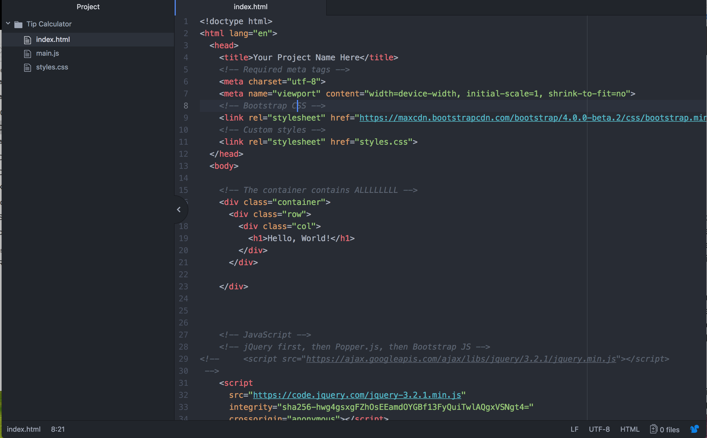
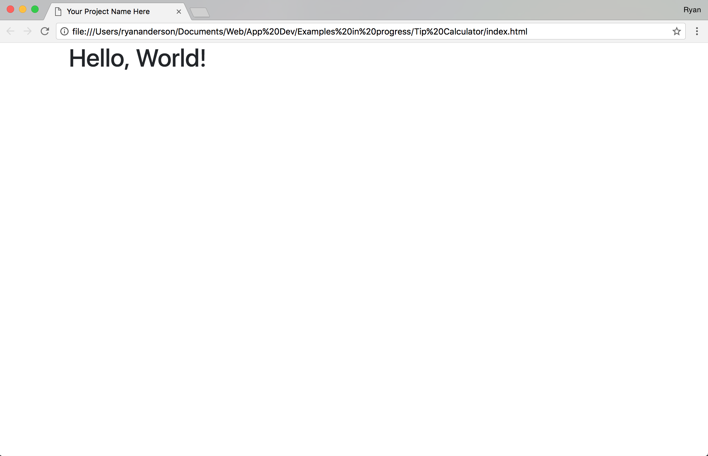
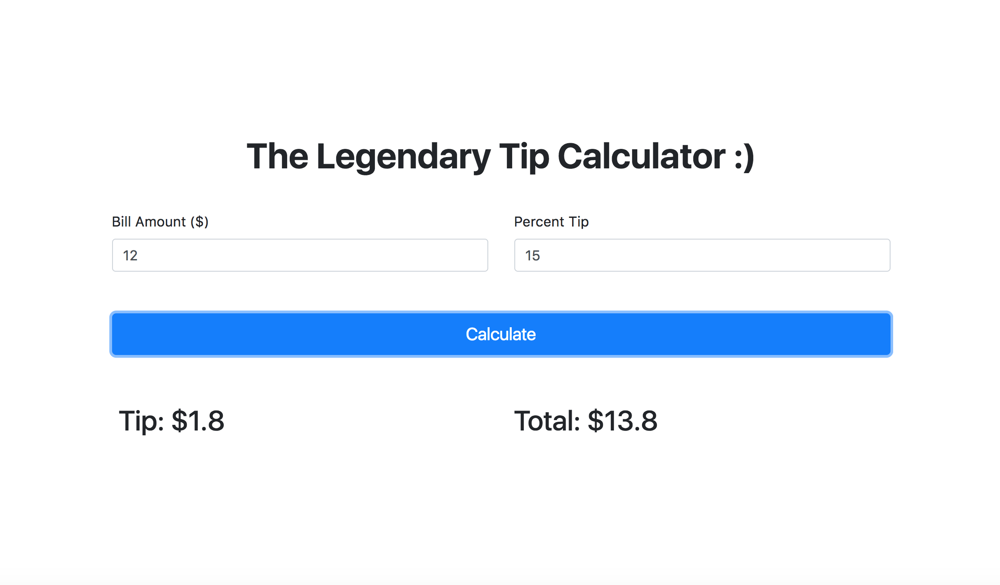
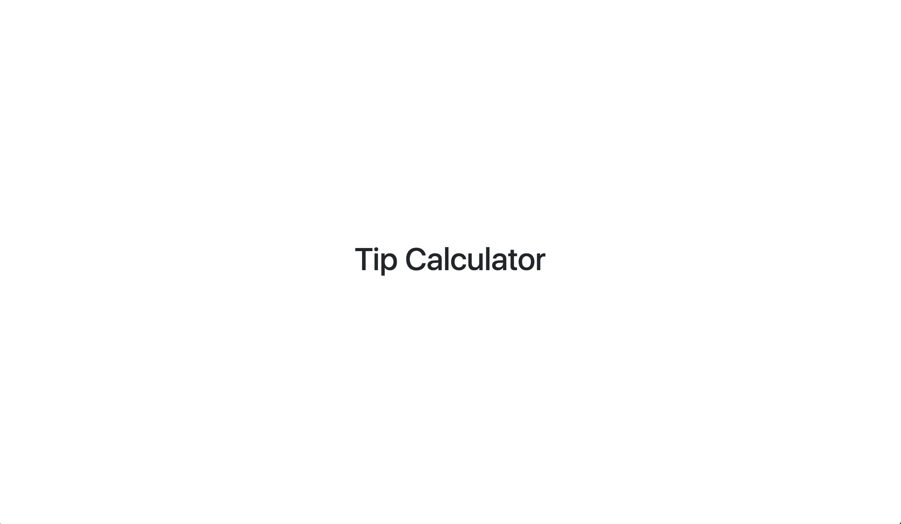
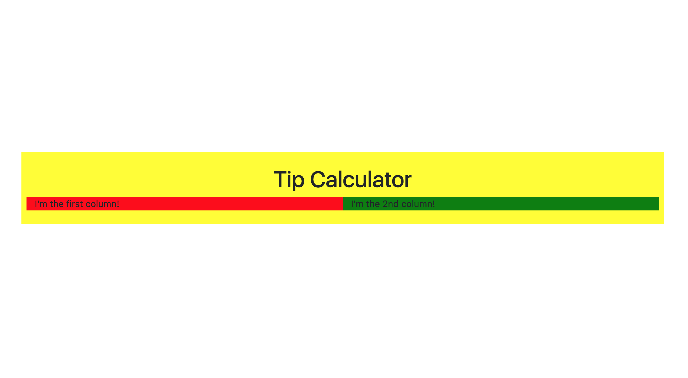
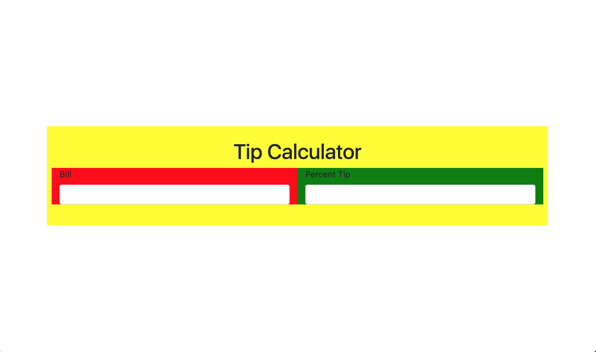
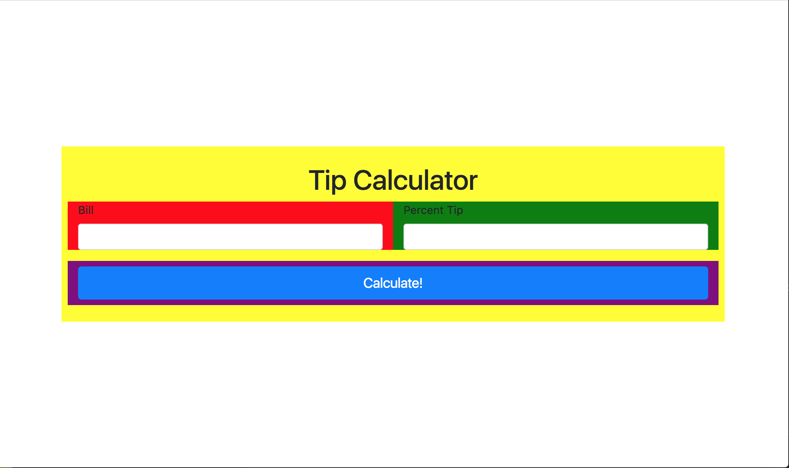
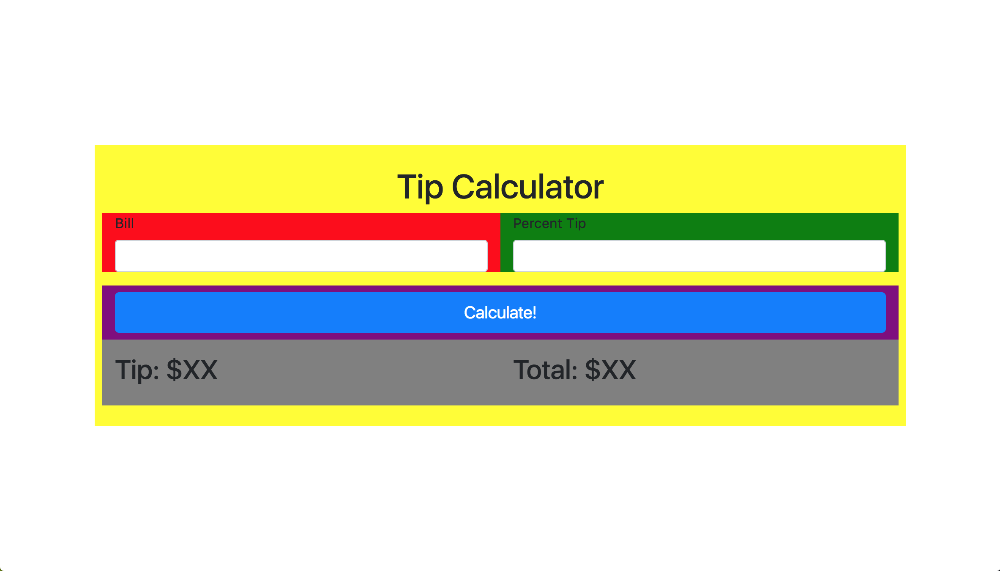
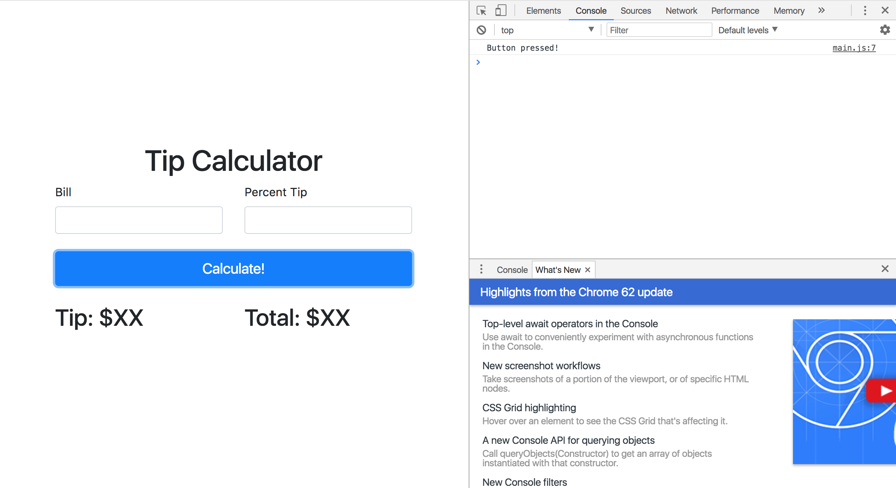
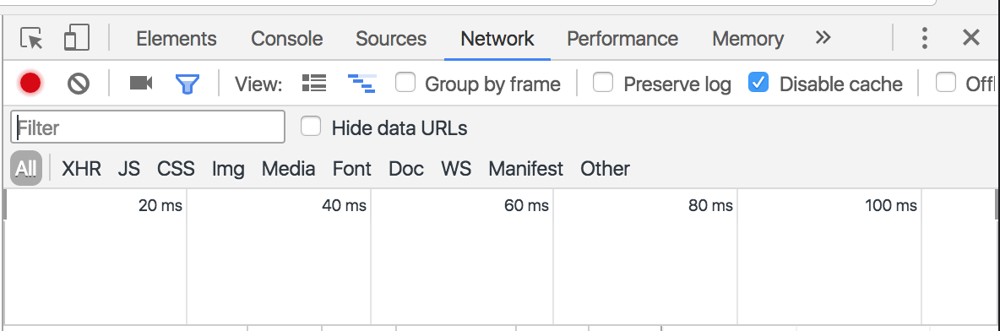

# Welcome to the Tip Calculator tutorial!

This short tutorial should walk you through the process of creating a simple web application-- specifically a calculator that tells you how much you need to pay at a restaurant. Before you begin, you should have basic knowledge of HTML, CSS, Javascript, and jQuery.

------------


## Setting Up

You must have a browser (Chrome or Firefox preferred) and a text editor (like Atom) installed. Create a folder for your project's files named "Tip Calculator". Finally, download the AppDevExamples repository [here](https://github.com/rkanderson/AppDevExamples/archive/master.zip) and place the contents of **Mini Project Template** in your folder.

Most text editors have some feature that allows you to view and interact with your project file structure. It's best to use these features when editing multiple files. For atom, either drag your project folder into the editor, or select your folder though file --> open. You should see something like this:


For now, testing your app is as simple as opening up index.html in your browser and hitting the refresh button every time you want to test a new change. Try double clicking on index.html, you should see the following display in your browser:



----------


## Building the User Interface

### Preview

There are several possible patterns for development. Some prefer to construct a minimal UI and jump straight into programming. We, however, will begin by creating most of what we need in terms of UI.
The following image represents our goal:

### Centering Rule
The first thing you may notice is that everything is centered both horizontally and vertically. There is a simple css trick to establish this centering rule for the entire page. Add the following code to styles.css

```css
html, body {
    height: 100%;
}

body {
	display: flex;
	align-items: center;
}
```

Refresh your page, and you'll already see the "Hello World" h1 tag centered vertically. 
In index.html, change the h1 tag to read "Tip Calculator" instead of "Hello World" and give it a text-center class. The h1 should look like this:

```html
<h1 class="text-center">Tip Calculator</h1>
```
  
And you should see the following upon refreshing your browser:	

Now time to create the more important ui pieces...

### Text Fields

Bootstrap has a nice pre-built system for text fields as well as many other input components like drop down menus, radio buttons, checkboxes, and file choosers. When you develop using any library, it's impossible to know how to do everything straight off your head. That's why you can use the power of the internet to quickly learn what you want. Simply googling **"[_Library Name_] how to make/use ___________"** almost always gives you what you need (often a question posted on Stack Overflow). In our case, we might google "Bootstrap how to make text fields," but what's even better is to have Bootstrap's official documentation handy-- because googling everything is sometimes tedious. Bootstrap's component documentation can be found [here](http://v4-alpha.getbootstrap.com/components/buttons/)

Recall that bootstrap works by structuring your webpage into rows with independent numbers of columns. Our h1 tag is currently in its own row, so we need to make a new one for the text fields. Then within that row, we need two column divs (div with class="col"), one for each text field. Modify the code within the container div so it looks like this:

```html
  <div class="container">
      <div class="row">
        <div class="col">
          <h1 class="text-center">Tip Calculator</h1>
        </div>
      </div>
      <div class="row">
        <div class="col">
          I'm the first column!
        </div>
        <div class="col">
          I'm the 2nd column!
        </div>
      </div>
    </div>
```
The following screenshot has been color coded to show the column structure. The container is yellow, the two new columns are red and green. Our h1 has been given no background color. Notice how the two columns only appear the second row (where we added the two column divs)

Try changing the width of your window. Notice how the content adapts? Bootstrap is good at that kind of thing.
Now we need to actually add the code for the text fields. This is where we can use that documentation. Documentation on text fields can be found in the "Forms" section on the Bootstrap components page (here's the [link](http://v4-alpha.getbootstrap.com/components/buttons/) again). 

The Documentation indicates that all bootstrap form inputs must have the class "form-control" be nested within a div with a class of "form-group". Our 2nd row surrounding div is a good spot to place our "form-control" class. As for the textual inputs, it's a matter of copying and pasting from the documentation!
Modify your code to look like this:

```html
  <div class="container">
      <div class="row">
        <div class="col">
          <h1 class="text-center">Tip Calculator</h1>
        </div>
      </div>
      <div class="row form-group"> <!--We added the form-group class here!-->
        <div class="col">
          <!--This is the first column!-->
          <label for="bill-field">Bill</label> <!--This label tells the user what the text field is for and has a "for" attribute with the id of the text-field. -->
          <input id="bill-field" class="form-control" type="text"> <!--This input has the form-control class. That tells bootstrap to style it!-->
        </div>
        <div class="col">
          <!--This is the second column-->
          <label for="percent-tip-field">Percent Tip</label>
          <input id="percent-tip-field" class="form-control" type="text">
        </div>
      </div>
    </div>
```

> The input tag is a standard HTML5 element. For more documentation specifically on the input tag, visit a site such as W3Schools.

Your refreshed page should look something like this: (without the colors)


### Button
Now we need a big button that says calculate! Buttons are the first thing mentioned in the Bootstrap components documentation! Check it out!
The documentation tells us that we need to use an HTML button tag and give it the class "btn" to tell Bootstrap that it should be styled. In addition, we can provide a second class that tells bootstrap just exactly what pre-defined style category the button fits into (primary, secondary, info, warning, etc). We should use class "btn-primary" since it's our most important (and only!) button on screen. Finally, we have several classes at our disposal that let us determine the size and shape of the button. "btn-lg" makes the button nice and big, and the "btn-block" class makes the button horizontally span its entire parent, which is closest to what we want. Our final button tag looks like this:

```html
<button id="calculate-button" class="btn btn-primary btn-lg btn-block">Calculate!</button>
```

And now we need to add that to a new row with just a single column (for now). Do you know how? See if you can do it on your own. Or just copy the code below, you dirty cheater.
```html
<div class="row"> <!--This entire row div goes just below the closing </div> tag for the row div that contained both text-fields-->
  <div class="col"> <!-- Just a single column for our lonely button -->
    <button id="calculate-button" class="btn btn-primary btn-lg btn-block">Calculate!</button>
  </div>
</div>
```

Your refreshed page should look like the following image. The new button has been given its own snazzy purple box for color coding purposes.


> Be sure you've put the next row div in the right spot, that is outside and just after the previous row div. The code should have this structure (we currently have a total of three row divs)

```html
<div class="container">

  <div class="row"> <!--First row!-->
  	<div class="col">
  		... <!--h1 tag in all its glory-->
  	</div>
  </div>


  <div class="row"> <!--2nd row!-->
  	<div class="col">
  		... <!--Bill text field-->
  	</div>
  	<div class="col">
  		... <!--Percent tip text field-->
  	</div>
  </div>


  <div class="row"> <!--3rd row!-->
  	<div class="col">
  		... <!--Our Button! WOOOOOOOHOOOOO-->
  	</div>
  </div>

</div>
```

### Results Display
Now we need an area to display the results after clicking the "Calculate Button" -- the **amount of tip** in USD and the **total** we owe. Without a doubt, we'll make a new row. Within the new row, we can create a display in a variety of ways, but a simple way is to split our two numbers into 2 columns. You may be able to create this part on your own, but please just copy the HTML below, because there's some tag structure that will come in handy once we build the logic of the app using javascript.

```html
<div class="container">

  <!--Everything we've done so far goes right here!-->
  ...

  <div id="results-display" class="row"> <!--Our new row for the results display!-->
    <div class="col">
      <h2>Tip: $<span id="tip-result">XX</span></h2>
    </div>
    <div class="col">
      <h2>Total: $<span id="total-result">XX</span></h2>
    </div>
  </div>


</div>
```
And you should end up with this. The new row for the results display has been color coded grey.


--------

## Building the Logic with Javascript
Ok so up until now we've just been stitching together a lifeless HTML corpse. Time to become Dr. Frankenstein and bring it to life-- with javascript.

### Divide and Conquer!
Like any big project, the best way to handle a big coding task is to break it down into tiny pieces and tackle each one individually. Often this will involve testing these pieces seperately from the entire app.

### Detecting the Button Press
This part's pretty important. We need to create code that fires off the moment our button is clicked. Thankfully, jQuery makes this immensely easy. Write the following inside the $(document).ready(function(){.....}) in main.js. This should be where it says "//let the magic begin!""
```javascript
$("#calculate-button").click(function(){ //<--#calculate-button is an id selector for the id we gave our button.
                                          // Be certain that the id you type is the exact same id you gave for the button in index.html.

  // This prints a message in the console. Helpful for testing or debugging!
  console.log('Button pressed!');
});
```

Reload your page and try clicking your button. Nothing happens, right? WRONG! Not if you check your browser's super secret developer console. The way you enable the console varies from browser to browser. For Chrome, go to View -> Developer -> Javascript Console. With the console open, you should see the console.log message from the code appear every time you click the button. ___The console is your most useful tool for writing javascript!!!___

Great! Our button works!
> **Note**: if you're experiencing problems with your code not updating, you probably need to disable caching need to disable cache. It should be in a little checkbox in the Network section of the developer panel.


### Reading the Text Fields
We eventually want to do some calculations with the numbers the user enters, but to do that, we first need to grab those numbers from our code! jQuery to the rescue! We can create a jQuery object out of both text fields by using #id-selectors and then grab exactly what is currently typed into the text field (its "value") by calling the .val() function. Modify the code to look like this:
```javascript
$(document).ready(function(){
  $("#calculate-button").click(function(){ //<--#calculate-button is an id selector for the id we gave our button.
                                          // Be certain that the id you type is the exact same id you gave for the button in index.html.
    // This prints a message in the console. Helpful for testing or debugging!
    console.log('Button pressed!');

  	const bill = parseFloat($('#bill-field').val()); //parseFloat converts the String datatype that you normally get from calling .val() to a float (decimal number)
  	const percentTip = parseFloat($('#percent-tip-field').val());
  	console.log('Bill: '+bill+', Percent Tip: '+percentTip);

  });
});
```
And again, make sure the #id-selector you use matches the id's of the text fields. You should be able to type anything into text fields and see them displayed in the console when you click the button:


### Making the calculations
Now we need to take these numbers and do some simple math. 
Tip = Bill* Percent Tip / 100
Total = Bill + Tip
Simple right? Now we turn it into code.

```javascript
$(document).ready(function(){
  $("#calculate-button").click(function(){

    //Everything else so far
    ..........

  	// Simple Mathz!
    const tip = bill * percentTip / 100;
    const total = bill + tip;
    console.log('Tip: '+tip+', Total: '+total);
  });
});
```


#### A Bug!
What if you leave a text field blank or don't type a number?

I typed IMA REBEL for the percent tip field. But in the console, it doesn't say "IMA REBEL" for percent tip. It instead says NaN. NaN in this case doesn't refer to a tasty indian bread, but to the fact that IMA REBEL is *Not a Number*. The parseFloat method we used to convert the value of the text field to a number is used to dealing with strings that look like numbers, but it had no idea what to do when it saw IMA REBEL, so to complain it spat out this funky javascript value called NaN which is pretty much useless. It screws up all our later calculations too (1 + NaN = NaN, our tip and total also are printed out in the console as NaN). If we see a NaN, we should escape and tell the user to enter in something else. To help accomplish this, javascript has a useful method called isNaN() that lets us test for if something isn't a number.
```javascript
$(document).ready(function(){
  $("#calculate-button").click(function(){ //<--#calculate-button is an id selector for the id we gave our button.
                                          // Be certain that the id you type is the exact same id you gave for the button in index.html.
    // This prints a message in the console. Helpful for testing or debugging!
    console.log('Button pressed!');

  	const bill = parseFloat($('#bill-field').val());
  	const percentTip = parseFloat($('#percent-tip-field').val());

    if(isNaN(bill) || isNaN(percentTip)) {
      alert("Please enter in numbers for both fields.");
      return; //Escape the function
    }

  	console.log('Bill: '+bill+', Percent Tip: '+percentTip);
    const tip = bill * percentTip / 100;
    const total = bill + tip;
    console.log('Tip: '+tip+', Total: '+total);

  });
});
```
The alert function gets the job done but is very ugly and generally doesn't appear in final products. But for now, it serves our purpose. We can come back to it later to improve it.
	
### Updating the Results Display
Now we need to take all those calculations we did and display them on the actual webpage. You may have noticed those span tags in the results-display and wondered what there purpose was. Well here it is: those span tags allow us to change the value of just a section of a block of text. For instance, the tip result says
```html
Tip: $<span id="tip-result">somevalueinhere</span>
```
By changing just the value of the span tag, we can make the Tip result show anything.
Modify your code to contain two additional lines:
```javascript
$(document).ready(function(){
  $("#calculate-button").click(function(){

  	// (Everything we did so far)
  	......

    $('#tip-result').html(tip); //Remember, the id selectors should match the id's in the HTML file!
    $('#total-result').html(total);
  });
});
```
Refresh your page, you should see the results display when you click the button.

### Finishing Touches
We now have what we would call a *Minimal Viable Product* or **MVP**. That means the app can do its most basic functionality, but it's *really* basic and not too pretty either. We could spend a lot of time writing CSS to perfect the aesthetic, but something we could do very quickly is prevent the results display from showing before the calculate button is clicked.
We would first make the results display appear hidden when the page initially loads by modifying its tag's style attribute, which let's us type in some css. Setting display to none hides any element.
```html
<div id="results-display" class="row py-3" style="display: none;">
 	...
</div>
```


Then add one line of javascript to make the results display show when the button is clicked.
```javascript
$(document).ready(function(){
  $("#calculate-button").click(function(){

  	// (Everything we did so far)
  	......

	$('#results-display').show();

  });
});
```


